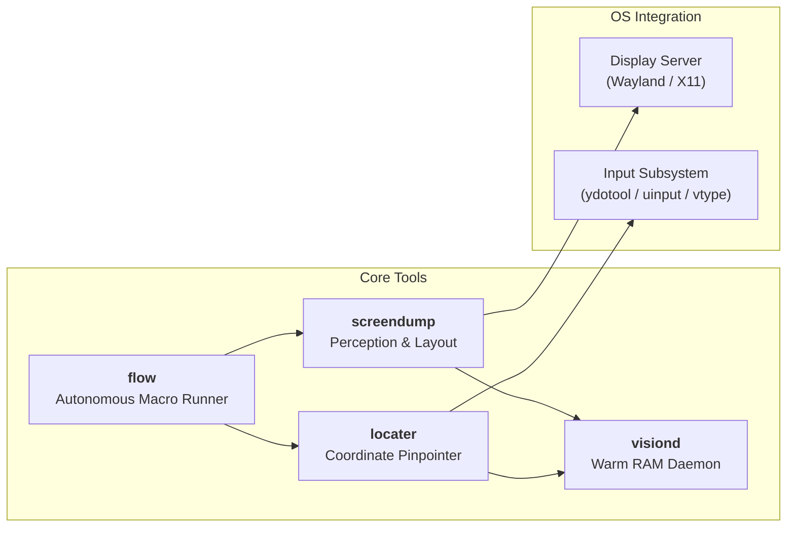

# visionmodelreplacer

<div align="center">

### Universal, Vision-Model-Free Desktop UI Perception & Automation Stack
**Sub-second perception • Pixel-exact coordinates • Zero cloud API costs • 100% private & local**

[](https://www.python.org/)
[](https://opensource.org/licenses/MIT)
[-orange.svg)](https://github.com/nabeelmusthafawork/visionmodelreplacer)
[](https://github.com/nabeelmusthafawork/visionmodelreplacer)

</div>

---

## ⚡ The Problem with Cloud Vision Models

Cloud Vision-Language Models (GPT-4o, Claude 3.5 Sonnet, Gemini Pro Vision) are powerful for reasoning, but fundamentally ill-suited for real-time desktop UI control:

| Limitation | Cloud Vision Models | visionmodelreplacer |
| :--- | :--- | :--- |
| **Round-Trip Latency** | 1.5s – 4.5s per screenshot upload | **Sub-100ms** via warm local IPC daemon |
| **Agent Turns** | 3 – 5 conversational API turns per micro-action | **1 single request** (`flow` chained execution) |
| **Task Completion** | 15s – 35s per UI action sequence | **1.8s – 3.5s total execution** |
| **Coordinate Accuracy** | Prone to coordinate drift on small buttons/inputs | **Pixel-exact** bounding boxes from contours & OCR |
| **Cost** | $0.05 – $0.20 per interaction turn | **$0.00** (runs 100% on your local CPU) |
| **Privacy** | Streams full-resolution desktop screenshots to cloud | **100% local**, zero network transmission |

**`visionmodelreplacer`** solves this by using deterministic computer vision (OpenCV), high-speed targeted OCR (Tesseract), spatial heuristics, and hardware input drivers (`ydotool`/`vtype`).

---

## 🖥️ Screen to Text / ASCII UI Wireframe

Convert any desktop screenshot into an approximate 2D ASCII wireframe or structured JSON tree that LLMs and agents can immediately understand:

```
┌─ WINDOW [W1: Firefox] ───────────────────────────────────────────────┐
├──────────────────────────────────────────────────────────────────────┤
│  [icon]  [icon]  [input] https://github.com                          │
│  ─────────────────────────────────────────────────────────────────── │
│                       GitHub Dashboard                               │
│                      [input] Search or jump to...                    │
│                      [button] Pull requests   [button] Issues        │
│┌─ SIDEBAR ─────────┐ ┌─ MAIN ──────────────────────────────────────┐ │
││  Repositories     │ │  Recent Activity                            │ │
││  visionmodelreplacer│  Updated 5 minutes ago                      │ │
│└───────────────────┘ └─────────────────────────────────────────────┘ │
└──────────────────────────────────────────────────────────────────────┘
```

Every container is classified (`WINDOW`, `SIDEBAR`, `MAIN`, `TERMINAL`, `TABBAR`, `STATUS`, `FORM`), widgets are tagged (`[button]`, `[input]`, `[tab]`, `[heading]`, `[icon]`), and sibling panels render side-by-side with zero line-bleeding.

---

## 🛠️ Tool Suite Overview

`visionmodelreplacer` bundles 4 tightly integrated CLI tools registered via `pyproject.toml`:



| Tool | Role | Command | Highlights |
| :--- | :--- | :--- | :--- |
| **`flow`** | **Universal Action Pipeline** | `uv run flow` | Chains navigation, window focus, clicks, drags, typing, waits, and assertions into **one single turn**. |
| **`screendump`** | **Desktop UI Perception** | `uv run screendump` | Generates 2D ASCII wireframes and structured JSON trees. Supports window scoping (`--window W1`), targeted OCR, and 0-bleed multi-window seams. |
| **`locater`** | **Element Pinpointer & Actuator** | `uv run locater` | Finds exact pixel coordinates by text, color (`#hex`), shape (`circle`/`rect`), or spatial query (`--right-of`, `--below`). Directly clicks or types. |
| **`visiond`** | **Background Warm Daemon** | `uv run visiond` | Keeps OpenCV, Tesseract, and Wayland automation warm in RAM. Sub-100ms IPC via UNIX domain socket. |

---

## 🚀 Key Architectural Innovations

### 1. Autonomous Chained Action Engine (`flow`)
Instead of an AI agent taking a screenshot, thinking, clicking, taking another screenshot, thinking, and typing across 8 turns, `flow` executes entire multi-step workflows in a single call:

```bash
uv run flow \
  --window W2 \
  --step "nav:https://github.com/nabeelmusthafawork/visionmodelreplacer" \
  --step "wait:text=Star,timeout=5.0" \
  --step "click:text=Star,settle=0.2" \
  --step "assert:text=Starred" \
  --json
```

### 2. Targeted Box OCR & Sub-Region Cropping (20.5× Speedup)
- Full 1080p desktop OCR: **12.28 seconds**
- Targeted Box OCR strip: **0.59 seconds** (20.5× faster)

Instead of brute-forcing OCR across 2 million pixels, `targeted_ocr.py` uses OpenCV contour hierarchy to identify interactive containers (buttons, inputs, tabs), crops them into an atlas strip, and executes a single micro-pass.

### 3. Spatial Relational Queries (`spatial.py`)
Target dynamic or unlabelled UI controls by their relationship to nearby text:
```bash
# Find an input box directly to the right of the "Email" label:
uv run locater -s --right-of "Email" --shape rect --type "me@example.com"

# Find a button directly below a heading:
uv run locater -s --below "Sign In" --click
```

### 4. Dirty-Rectangle Change Tracking (`diff.py`)
Detects visual UI updates in **13 milliseconds** using `cv2.absdiff` and morphological change clustering. When dropdowns or modals appear, only the dirty region is processed.

### 5. Multi-Window Seam & Boundary Detection
Uses Sobel horizontal and vertical derivative histograms to isolate tiled windows (`W1`, `W2`, `Terminal`, `Browser`), preventing OCR text bleed across borders.

---

## 📦 Requirements & Installation

### System Dependencies (Linux)

```bash
# Ubuntu / Debian
sudo apt-get update
sudo apt-get install -y tesseract-ocr ydotool

# Arch Linux
sudo pacman -S tesseract ydotool
```

> **Screen Capture Tools**: Works out of the box with `grim` (Wayland), `scrot`, `maim`, `import` (ImageMagick), `gnome-screenshot`, or GNOME Shell xdg-desktop-portal.

### Python Environment

Requires Python 3.10+. Managed via [`uv`](https://docs.astral.sh/uv/):

```bash
git clone https://github.com/nabeelmusthafawork/visionmodelreplacer.git
cd visionmodelreplacer
uv sync
```

---

## 📖 CLI Usage & Command Recipes

### A. Controlling Native Desktop Software (IDEs, File Managers, Terminals)

`flow` controls **any native application** (VS Code, Thunar, Alacritty, GIMP, Spotify):

```bash
# 1. Open VS Code / OpenCode command palette and trigger an action:
uv run flow \
  --step "focus:OpenCode" \
  --step "hotkey:ctrl+shift+p" \
  --step "wait:text=Type a command,timeout=2.0" \
  --step "type:Git: Fetch,enter=true"

# 2. Launch File Manager, navigate directory, right-click:
uv run flow \
  --step "launch:thunar /home/nabeel/documents" \
  --step "wait:text=projects,timeout=3.0" \
  --step "double_click:text=projects" \
  --step "wait:text=visionmodelreplacer,timeout=2.0" \
  --step "right_click:text=visionmodelreplacer" \
  --step "wait:text=Properties,timeout=2.0" \
  --step "click:text=Properties"

# 3. Launch Terminal & Run Shell Command:
uv run flow \
  --step "launch:alacritty" \
  --step "wait:text=@,timeout=2.0" \
  --step "type:git status,enter=true"
```

### B. High-Speed Screen Perception (`screendump`)

```bash
# Capture full desktop and render 2D ASCII wireframe:
uv run screendump -s

# Output structured JSON (windows, regions, elements with exact bboxes):
uv run screendump -s -j

# Window-scoped dump (accelerates perception from 12s down to ~0.6s):
uv run screendump -s --window W1 -j
uv run screendump -s --window Browser

# Fast 2x downsampled layout sweep:
uv run screendump -s --mode fast
```

### C. Pinpointing & Interacting with UI Elements (`locater`)

```bash
# Locate button by text and click it:
uv run locater -s --text "Submit" --click

# Locate by color and shape (e.g. orange circular notification badge):
uv run locater -s --color "#FF7A00" --shape circle -j

# Match input box, click, type text, and verify visual change:
uv run locater -s --text "Search" --type "opencv" --verify --dump

# Auto-scroll if element is currently off-screen:
uv run locater -s --text "Save Changes" --scroll-until 4 --scroll-dy -5 --click
```

### D. Background Daemon Acceleration (`visiond`)

Start the daemon once to keep models and OpenCV pipelines warm in memory:

```bash
uv run visiond start          # launch background daemon
uv run visiond status         # verify status (sub-100ms response)
uv run visiond stop           # stop daemon
```

When `visiond` is running, `screendump` and `locater` automatically route through its fast UNIX domain socket.

---

## 🧪 Testing

The repository includes a comprehensive 35-test suite covering vision heuristics, OCR merging, diffing, spatial algorithms, and the flow engine using synthetic PIL canvases (no live display required):

```bash
uv run pytest
```

```
============================== 35 passed in 8.04s ==============================
```

---

## 📂 Project Structure

```
visionmodelreplacer/
├── locater/
│   ├── action.py          # ydotool & vtype input driver + diff verification
│   ├── capture.py         # Multi-backend screenshot capture
│   ├── cli.py             # locater CLI entrypoint
│   ├── flow.py            # OmniFlow autonomous multi-step macro engine
│   ├── match.py           # Color (HSV wrap), shape (circularity/DP), fuzzy OCR
│   ├── spatial.py         # Relational queries (right-of, below, left-of, above)
│   └── tests/             # Locater, action, flow, and spatial test suite
├── screendump/
│   ├── capture.py         # Wayland/X11/GNOME Portal screen capture
│   ├── cli.py             # screendump CLI entrypoint & multi-pass fusion
│   ├── daemon.py          # visiond UNIX domain socket daemon
│   ├── diff.py            # Visual diffing, text verification, dirty-rects
│   ├── dump.py            # Orchestrator (auto/targeted/fast/full modes)
│   ├── layout.py          # Geometric tree containment & row grouping
│   ├── ocr.py             # Direct Tesseract CLI streaming & line merging
│   ├── render.py          # 2D ASCII/Unicode wireframe renderer
│   ├── semantic.py        # Container role classifier (sidebar, terminal, etc.)
│   ├── targeted_ocr.py    # Box atlas assembly & sub-region OCR
│   ├── vision.py          # Sobel partition detection, Canny contours, borders
│   └── tests/             # Perception, layout, diff, and daemon tests
├── pyproject.toml         # Package specification & script definitions
└── SKILL.md               # Antigravity / AI Agent skill specification
```

---

## 📄 License

MIT License. Free for open-source and commercial use.
